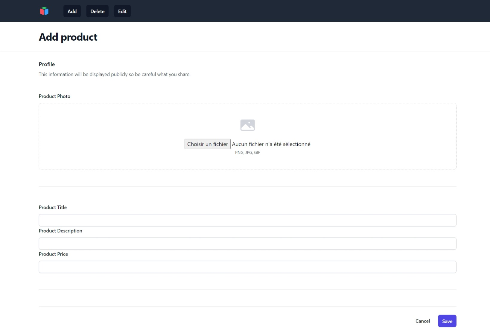
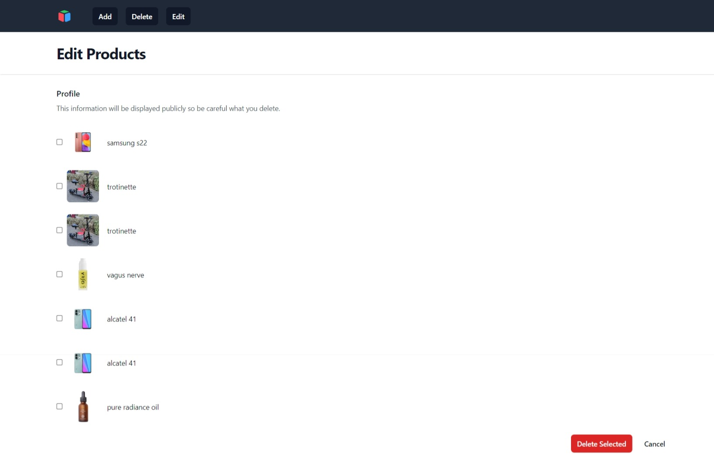
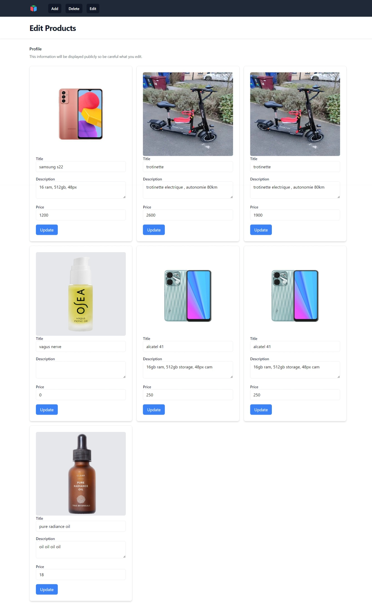

# Avito Refactoring Project

## Overview

L'entreprise Avito, dans sa logique de refactorisation, souhaite redéfinir les modèles de son site d'annonces. Ce projet vise à accomplir plusieurs tâches, allant de la création de diagrammes à l'implémentation de scripts PHP et MySQL pour la gestion de la base de données.

## Project Structure

### 1. Use Case Diagram

- File: `use_case_diagram.png`

Description: This file contains the use case diagram illustrating the various interactions between users and the system.

### 2. Class Diagram

- File: `class_diagram.png`

Description: This file contains the class diagram outlining the essential classes and their relationships for the Avito annonces site.

### 3. Database Initialization

#### Files:

- `connection.php`
- `db.sql`

Description: These files contain the PHP and MySQL code necessary to initialize the database based on the previously defined models. Ensure you have a proper MySQL server setup and configured.

### 4. Data Insertion

#### Files:

- `dashboard.php`

Description: These files include PHP code for inserting data into the database using a form. Users can interact with the form to add new entries to the system.

### 5. Data Deletion

#### Files:

- `delete.php`

Description: These files include PHP code for deleting specific entries (`delete.php`) or clearing the entire database (`deleteAll.php`).

### 6. Editing Data

#### File:

- `edit.php`

Description: This file contains PHP code for editing existing data in the database. Users can interact with this functionality to modify information as needed.

### 7. Main Application

#### File:

- `index.php`

Description: The main file for the Avito annonces site. It should include the necessary code for user interaction and data presentation. Ensure all other files and functionalities are appropriately included.

### 8. Website 

#### File:

*Page d'accueil du site Avito*

*Exemple de la page du tableau de bord*

*Exemple de la page du seppression des annonces*

*Exemple de la page du modificaation des annonces*

## Usage

1. Clone the repository: `git clone <https://github.com/Youcode-Classe-E-2023-2024/Oussama_el_farihi_Avito.git>`
2. Set up your MySQL server and configure `connection.php` with the appropriate database credentials.
3. Execute the SQL scripts in `db.sql` to initialize the database.
4. Access the `index.php` file in a web browser to interact with the Avito annonces site.

## Contributors

- [Elfarihi Oussama]

Feel free to contribute to the project by submitting pull requests or reporting issues.

## License

See the [LICENSE.md](LICENSE.md) file for details.
